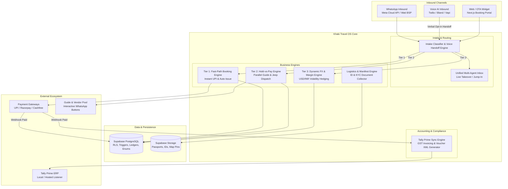
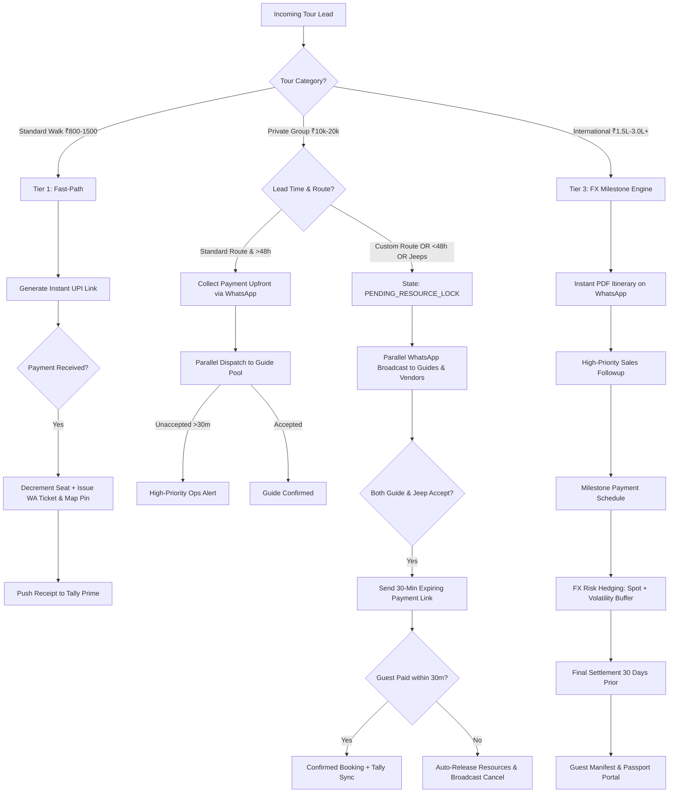

# System Architecture & Technical Specification
## Khaki Travel Operating System (`khaki-travel-os`)

### 1. Executive Architecture Summary

**Khaki Travel OS** is an event-driven, low-friction, high-velocity Travel Operations System purpose-engineered for Khaki Tours in Mumbai. It fuses CRM, ERP, and Omnichannel Communications into a reactive platform capable of processing instant low-ticket walking tours autonomously while providing high-touch orchestration for bespoke private tours and high-value international expeditions.

---

## 2. Core Operational Pillars & Subsystems

### Subsystem A: Intake & Qualification Hub
1. **Voice AI Inbound Protocol:**
   - Callers connecting with Khaki Tours voice agents (powered by Vapi/Bland/Twilio) undergo fast qualification.
   - **Explicit Opt-in Rule:** Voice agent executes the mandatory script:
     > *"To ensure your booking details are 100% accurate and to send your secure payment link, may I have your permission to message you on WhatsApp right now?"*
   - Once verbal approval is recognized, the endpoint `/api/voice` triggers an outbound WhatsApp utility template to the caller's CLI phone number.
2. **Unified Multi-Agent Inbox:**
   - Centralizes real-time WhatsApp conversations, Voice AI call transcripts, and internal ops tags.
   - **Human Live Takeover ("Jump-In"):**
     - Clicking `[Takeover Session]` sets `bookings.human_takeover_active = TRUE`.
     - Suppresses bot auto-replies instantly.
     - Notifies the operations team member and locks the thread.

---

### Subsystem B: Three-Tier Operating Architecture

---

### Subsystem C: Parallel Vendor & Guide Dispatch Engine
- Dispatches are dispatched via Meta Cloud API using interactive buttons:
  - `[Accept Booking]`
  - `[Decline / Busy]`
- When `broadcast_sent_at` exceeds `timeout_minutes` (default 30 mins) without acceptance:
  - Background cron/worker marks status `EXPIRED`.
  - Automatically cascades request to backup tier or fires high-priority alert to Operations Desk.

---

### Subsystem D: Dynamic FX & Volatility Engine
For Tier 3 International Expeditions:
- Spot rate $R_{\text{spot}}$ is retrieved via Forex API.
- Volatility buffer $B_{\text{volatility}}$ is applied (standard 3.00% to 5.00%).
- Guaranteed quotes are issued with defined validity horizons.
- At $T - 30\text{ days}$ to departure, final balance is settled against spot rate $R_{\text{settlement}}$.

---

### Subsystem E: Tally Prime Accounting Engine
- Emits XML vouchers conformant with Tally Prime schema.
- Automatic GST computation:
  - B2C Walk / Heritage: 5% Composite Tour Operator Scheme (SAC 998555).
  - B2B Corporate / Custom Invoices: 18% GST with input tax credit breakdown.
- Synchronized through direct HTTP XML POST to local or hosted Tally Prime port (Default: 9000).

---

## 3. Resilience, Security & Anti-Spam Strategy

1. **Meta Quality Rating Protection:**
   - Inbound click-to-chat QR codes across marketing collateral.
   - Utilization of Meta Utility and Authentication templates.
   - Strict adherence to 24-hour customer service window for free-form conversational replies.
2. **Gmail Deliverability:**
   - Plain-text 1-to-1 founder emails without tracking pixels or bloated HTML for personalized follow-ups.
3. **Database Security:**
   - Row Level Security (RLS) enabled on all tables.
   - Public anonymous access restricted strictly to active tour catalogs.
   - All write operations require authenticated staff tokens or service-role signatures for webhooks.
