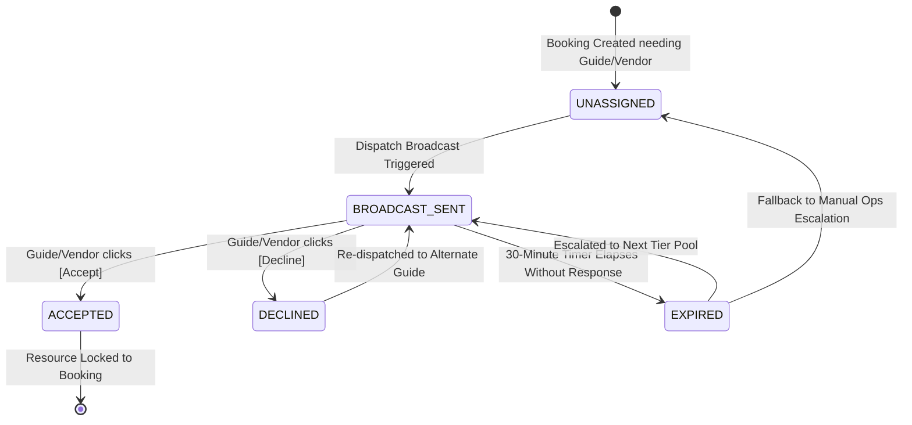

# State Machine Specifications & Transition Rules
## Khaki Travel Operating System (`khaki-travel-os`)

This document defines the formal finite state machines (FSM), transitions, triggers, and rollback rules governing Bookings and Dispatches.

---

## 1. Booking State Machine

```mermaid
stateDiagram-v2
    [*] --> LEAD_NEW: Inbound Lead (WA/Voice/Web)

    state "Tier 1: Standard Scheduled Walk" as T1 {
        LEAD_NEW --> PAYMENT_PENDING: Fast-Path Trigger (Instant UPI Link)
        PAYMENT_PENDING --> CONFIRMED: Payment Received (Webhook)
        PAYMENT_PENDING --> CANCELLED: Timeout (15 mins unpaid)
    }

    state "Tier 2: Private Heritage Tour" as T2 {
        LEAD_NEW --> PENDING_RESOURCE_LOCK: Hold-Track (<48h or Custom)
        PENDING_RESOURCE_LOCK --> PAYMENT_PENDING: All Resources Locked (Guide + Jeep Confirmed)
        PENDING_RESOURCE_LOCK --> CANCELLED: Resource Lock Failed / Guide Declined
    }

    state "Tier 3: International Expedition" as T3 {
        LEAD_NEW --> PAYMENT_PENDING: Milestone 1 / Deposit Invoice Issued
        CONFIRMED --> PENDING_RESOURCE_LOCK: 30-Day FX Settlement Adjustments
    }

    CONFIRMED --> COMPLETED: Tour Executed & Manifest Closed
    CONFIRMED --> CANCELLED: Cancellation / Refund Initiated
    CANCELLED --> [*]
    COMPLETED --> [*]
```

### Table 1.1: Booking State Transition Matrix

| Initial State | Target State | Trigger / Event | Guard / Conditions | Action Executed |
| :--- | :--- | :--- | :--- | :--- |
| `LEAD_NEW` | `PAYMENT_PENDING` | `FAST_PATH_INITIATED` | `category == 'STANDARD_WALK'` AND `seats_available >= group_size` | Generate UPI link via Gateway; send WhatsApp button with 15m expiration. |
| `LEAD_NEW` | `PENDING_RESOURCE_LOCK` | `HOLD_TRACK_INITIATED` | `category == 'PRIVATE_GROUP'` AND (`lead_time < 48h` OR `custom_route == true` OR `jeep_required == true`) | Create `dispatch_requests` for Guide and Jeep; broadcast interactive buttons via WhatsApp. |
| `PENDING_RESOURCE_LOCK` | `PAYMENT_PENDING` | `ALL_RESOURCES_LOCKED` | All related `dispatch_requests.status == 'ACCEPTED'` | Generate 30-minute expiring payment link; send WhatsApp prompt to customer. Set `hold_expires_at = NOW() + 30m`. |
| `PENDING_RESOURCE_LOCK` | `CANCELLED` | `RESOURCE_TIMEOUT` | Any required dispatch item expires after 30 mins with no guide acceptance | Release held resources; fire high-priority alert to Operations Desk; send apology & alternatives to guest. |
| `PAYMENT_PENDING` | `CONFIRMED` | `PAYMENT_CAPTURED` | Gateway webhook verified signature AND amount matches `total_amount_inr` | 1. Trigger `trg_manage_seats` to decrement seats.<br>2. WhatsApp Ticket + Google Maps pin dispatched.<br>3. Push sales voucher to Tally Prime. |
| `PAYMENT_PENDING` | `CANCELLED` | `PAYMENT_TIMEOUT` | `NOW() > payment_link_expires_at` | Void payment link; mark booking cancelled; release resource holds if Tier 2. |
| `CONFIRMED` | `COMPLETED` | `TOUR_CONCLUDED` | `departure_date + duration < NOW()` | Send review request on WhatsApp; update contact `rfm_score`; close manifest. |
| `CONFIRMED` | `CANCELLED` | `MANUAL_REFUND` | Agent approved or customer eligible within policy | Issue refund via gateway API; release seat; emit credit note voucher to Tally Prime. |

---

## 2. Dispatch Request State Machine



### Table 2.1: Dispatch Request Transition Matrix

| Initial State | Target State | Trigger / Event | Guard / Conditions | Action Executed |
| :--- | :--- | :--- | :--- | :--- |
| `UNASSIGNED` | `BROADCAST_SENT` | `TRIGGER_DISPATCH` | Eligible guides in pool > 0 | Send WhatsApp interactive template with `[Accept]` & `[Decline]` buttons. Set `broadcast_sent_at = NOW()`. |
| `BROADCAST_SENT` | `ACCEPTED` | `INTERACTIVE_BUTTON_ACCEPT` | First responder wins; lock timestamp recorded | 1. Update `status = 'ACCEPTED'`.<br>2. Set `responded_at = NOW()`.<br>3. Send confirmation WhatsApp to Guide with meeting pin.<br>4. Notify Ops Dashboard. |
| `BROADCAST_SENT` | `DECLINED` | `INTERACTIVE_BUTTON_DECLINE` | Responder clicks decline | Log refusal reason; re-broadcast immediately to next eligible guide in queue. |
| `BROADCAST_SENT` | `EXPIRED` | `CRON_TIMEOUT_CHECK` | `NOW() > broadcast_sent_at + 30 MINUTES` AND `status == 'BROADCAST_SENT'` | Update `status = 'EXPIRED'`; raise Ops emergency banner; trigger automated phone call or WhatsApp escalation to Head of Ops. |

---

## 3. Human Live Takeover ("Jump-In") State Matrix

The human takeover override operates as a parallel state layer over any active booking conversation:

```
[System Automated Mode] 
       │
       │  (Agent clicks [Takeover Session] in Unified Inbox)
       ▼
[Human Live Takeover Mode]
  - bookings.human_takeover_active = TRUE
  - System bot AI replies suppressed
  - Inbound messages tagged for assigned agent
  - Visual status badge: "Human Active"
       │
       │  (Agent clicks [Release to Bot])
       ▼
[System Automated Mode]
  - bookings.human_takeover_active = FALSE
  - Bot resumes qualification / dispatch logic
```
